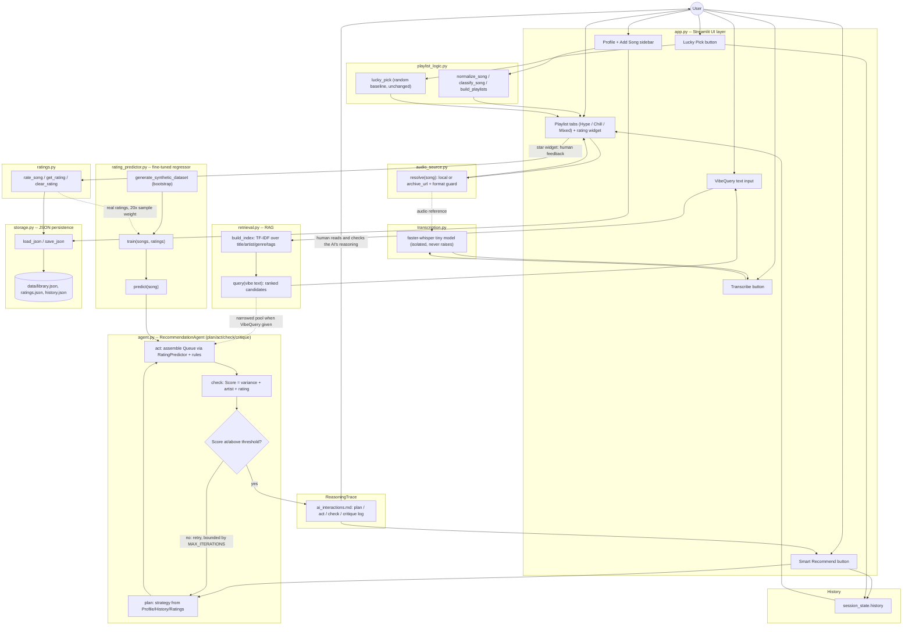

# Playlist Chaos → Agentic Music System

An applied-AI extension of a Module 1-3 mini-project: a Streamlit music app where a
rule-based agent plans, assembles, and self-critiques song recommendations; a free-text
retrieval feature searches songs by "vibe"; and a locally-trained model predicts how a
user would rate songs they haven't heard yet. No LLM, no API key, no cloud calls,
no cost to run.

## Original project: Playlist Chaos

This repo began as **Playlist Chaos**, a Module 1-3 mini-project (see the assignment
brief preserved in `instructions.txt`, and the original logic still present in
`playlist_logic.py`). Playlist Chaos sorted a small hardcoded list of songs into three
mood buckets — Hype, Chill, and Mixed — based on energy and genre thresholds defined by
a user "profile," and offered a "Lucky Pick" that returned one random song from a chosen
bucket. It had no real audio, no memory of user taste, no way to search by feeling, and
no reasoning behind its one recommendation mechanism — the explicit gap this project
closes.

## What this system does

The extension keeps `classify_song`/`build_playlists`/`lucky_pick` from Playlist Chaos
completely intact (mood buckets are still computed the same way, and Lucky Pick is still
a plain random choice — the "dumb" baseline kept for contrast) and adds, around it:

- **Real audio** — local files or direct archive URLs, played natively via
  `st.audio()`, with a format guard that shows a clear message instead of crashing on
  an unsupported format.
- **Ratings** — 1-5 star ratings per song, persisted to JSON, with "unrated" kept as a
  distinct state (never a numeric 0).
- **VibeQuery (RAG)** — a free-text box ("rainy night drive") retrieves ranked song
  candidates via TF-IDF over song metadata (title/artist/genre/tags — never lyrics).
- **RatingPredictor (fine-tuned/specialized model)** — a locally-trained scikit-learn
  regressor that predicts how a user would rate an unrated song, bootstrapped with a
  synthetic dataset and measurably shifted by real ratings once they exist.
- **RecommendationAgent ("Smart Recommend")** — a rule-based agent that plans a
  strategy from the user's profile/history/ratings, assembles a candidate Queue, checks
  its own work with a numeric Score (energy variance, artist-repeat penalty, rating
  alignment), and retries (bounded) if the Score is too low — logging every iteration
  to `ai_interactions.md` as a ReasoningTrace.
- **TranscriptionTool** — an isolated, optional local `faster-whisper` wrapper for
  karaoke/lyrics text, designed so its absence or failure can never break the rest of
  the app.
- **eval_harness.py** — a standalone reliability script that runs the agent against six
  fixed named scenarios (one deliberately unwinnable) and self-checks that pass/fail
  match expectations.

## Architecture overview

`app.py` is the Streamlit UI layer only (no business logic). It calls into
`playlist_logic.py` (mood classification, Lucky Pick), `audio_source.py` (playback
resolution), `ratings.py` (star ratings), `retrieval.py` (VibeQuery/RAG),
`rating_predictor.py` (the fine-tuned regressor), `agent.py` (the RecommendationAgent,
which itself calls `retrieval.py` and `rating_predictor.py`), and `transcription.py`
(isolated karaoke/lyrics tool). Everything that needs to persist goes through
`storage.py`'s shared JSON load/save helpers into `data/*.json`.

Two points are where a human is explicitly in the loop:

1. **Rating a song** (human feedback in) — the star widget writes to `ratings.py`,
   which feeds `rating_predictor.py`'s training data (real ratings are weighted 20x a
   synthetic row, so a handful of real ratings measurably move predictions).
2. **Reading the ReasoningTrace** (human checking AI's work) — every `agent.recommend()`
   run appends a plain-text plan/act/check/critique record to `ai_interactions.md`, so a
   user (or grader) can inspect *why* the agent produced a given Queue, not just trust
   the result.

Full Mermaid source: [`diagrams/architecture.mmd`](diagrams/architecture.mmd).



## Setup instructions

```bash
git clone <this-repo-url>
cd applied-ai-system-project
pip install -r requirements.txt
streamlit run app.py
```

Notes:

- `faster-whisper` (in `requirements.txt`) is an optional, heavy dependency used only by
  the Transcribe button. If it isn't installed, or fails to download/load its model (no
  network, etc.), `transcription.py` catches that and returns a typed "unavailable"
  result — the rest of the app (playback, ratings, VibeQuery, Smart Recommend) keeps
  working normally. You do not need it installed to run or grade the rest of the system.
- The app starts pre-loaded with `data/library.json` (22 songs) and 3 bundled sample
  audio files under `data/samples/` (see "Bundled sample audio" below) — no external
  files are required to see real playback/rating/recommendation behavior.
- Runtime state (`data/ratings.json`, history) is created on first write and is
  gitignored; `data/library.json` and `data/samples/` are the tracked seed content.

## Sample interactions (reproducible execution evidence)

All output below is pasted from real runs against this exact codebase — not
hand-written. Reproduce any of them with the commands shown.

### 1. End-to-end reliability check: `python eval_harness.py`

Runs the RecommendationAgent against six fixed named scenarios (one deliberately
designed to be unwinnable) and self-checks that actual pass/fail matches what each
scenario was built to prove.

```
$ python eval_harness.py
Scenario                   Result    Score  Iters  Note
-------------------------------------------------------
cold_start                 PASS      0.697      1  empty history/ratings against the full library -- baseline explore_unrated path | strategy=explore_unrated
established_taste          PASS      0.741      1  >=3 real high ratings on rock songs -- exercises favor_high_rated strategy | strategy=favor_high_rated
vibe_query_jazz            PASS      0.657      1  vibe_query narrows to jazz-genre/tagged songs spanning multiple energies -- exercises use_vibe_candidates | strategy=use_vibe_candidates
diversify_artist_history   PASS      0.697      1  recent history repeats one artist -- exercises diversify_artist strategy over a diverse library | strategy=diversify_artist
custom_profile_jazz_lover  PASS      0.747      1  non-default Profile + real jazz ratings -- broadens coverage beyond DEFAULT_PROFILE | strategy=favor_high_rated
impossible_artist_repeat   FAIL      0.350      4  2-song pool, same artist, both rated 1 star -- artist-repeat + low rating caps best-case Score at 0.45 < threshold 0.55, so retries must exhaust | exhausted retries

Harness self-check OK: all 6 scenarios behaved as designed.
```

**This is the reliability/guardrail evidence**: `impossible_artist_repeat` is
mathematically incapable of clearing the Score threshold (see the arithmetic in
`eval_harness.py`'s `build_scenarios()`), and the harness confirms the agent's bounded
retry loop (4 iterations, `MAX_ITERATIONS`) correctly gives up rather than looping
forever or silently reporting success on a bad Queue.

### 2. AI feature behavior — VibeQuery (RAG) retrieval

```python
import storage, retrieval

songs = storage.load_json('data/library.json', default=[])
index = retrieval.build_index(songs)
results = retrieval.query(index, 'rainy night drive', top_k=5)
for s in results:
    print(f"  - {s['title']} by {s['artist']} (genre {s['genre']}, energy {s['energy']}, tags {s['tags']})")
```

Real output:

```
Query: "rainy night drive" -> top 5 candidates:
  - Night Drive by Neon Echo (genre electronic, energy 6, tags ['synth'])
  - Thunderstruck by AC/DC (genre rock, energy 9, tags ['classic', 'guitar'])
  - Lo-fi Rain by DJ Calm (genre lofi, energy 2, tags ['study'])
  - Soft Piano by Sleep Sound (genre ambient, energy 1, tags ['sleep'])
  - Bohemian Rhapsody by Queen (genre rock, energy 8, tags ['classic', 'opera'])
```

Note the candidates span Hype (Thunderstruck), Chill (Lo-fi Rain, Soft Piano), and Mixed
moods — VibeQuery never pre-filters by Playlist bucket, exactly as designed.

### 3. AI feature behavior — Smart Recommend (RecommendationAgent)

```python
import storage, agent
from playlist_logic import DEFAULT_PROFILE

songs = storage.load_json('data/library.json', default=[])
profile = dict(DEFAULT_PROFILE)
profile['name'] = 'Demo User'
history = []
ratings = {'thunderstruck::ac/dc': 5, 'bohemian rhapsody::queen': 5, 'sandstorm::darude': 4}

queue, trace = agent.recommend(songs, profile, history, ratings, vibe_query=None)
```

Real output:

```
Profile: Demo User | History length: 0 | VibeQuery: none
Score: 0.697 (threshold 0.55) in 1 iteration(s)
Exhausted retries: False
Queue:
  - Sandstorm by darude (genre electronic, energy 10, mood Hype)
  - Thunderstruck by ac/dc (genre rock, energy 9, mood Hype)
  - Smells Like Teen Spirit by nirvana (genre rock, energy 9, mood Hype)
  - Sweet Child O' Mine by guns n' roses (genre rock, energy 8, mood Hype)
  - Bohemian Rhapsody by queen (genre rock, energy 8, mood Hype)
  - Night Drive by neon echo (genre electronic, energy 6, mood Mixed)
```

With 3 real 4-5 star ratings present (meeting `MIN_RATINGS_FOR_TRUST`), the agent's
`plan` step chose the `favor_high_rated` strategy and produced a Queue that cleared the
Score threshold (0.697 ≥ 0.55) on its first iteration — no retry needed. The full
plan/act/check/critique trace for this exact run is appended in `ai_interactions.md`
under `## Run at 2026-07-25 01:35:55 UTC`.

Together, examples 2 and 3 (plus the eval_harness table above) cover: an end-to-end run
with multiple distinct inputs, the required AI feature (RAG retrieval + the agentic
plan/act/check/critique loop) actually changing what the system returns, and reliability
evidence via bounded-retry pass/fail behavior — with clear, real, copy-pasted outputs
for each case.

## Design decisions

Full rationale lives in [`SPEC.md`](SPEC.md) and [`CONTEXT.md`](CONTEXT.md); summarized
here:

- **Rule-based agent, not an LLM** — see [ADR 0001](docs/adr/0001-no-llm-local-only-agent.md).
  Running everything (RecommendationAgent, RatingPredictor, TranscriptionTool) with zero
  API keys means zero added cost and no external dependency to fail or rate-limit. A
  local LLM (e.g. via Ollama) was considered for more natural-sounding reasoning traces,
  but rejected: it adds an install/model-download/RAM-CPU cost and makes
  ReasoningTrace output non-deterministic, which works against reproducible grading
  evidence. The agent's "reasoning" is therefore deterministic Python logic scored
  against energy variance, artist repeats, and RatingPredictor output.
- **Plain JSON storage, not a database** — per `SPEC.md`, this is a single-user, single-
  machine app (matching Playlist Chaos's existing Streamlit session-state scope). JSON
  via `storage.py` needs no server process, survives restarts, and degrades to an empty
  default with a logged warning on a missing/malformed file rather than crashing — a
  database would add setup friction with no corresponding benefit at this scale.
- **Synthetic bootstrap for RatingPredictor** — real ratings are sparse, especially
  early on, so `rating_predictor.py` always trains on a deterministic synthetic dataset
  (a made-up heuristic taste rule, not real taste data) so the regressor has something
  to fit before the user has rated anything. Real ratings, once present, are fit with
  20x the sample weight of a synthetic row (`REAL_RATING_WEIGHT`) so a handful of real
  ratings can still measurably shift predictions instead of being statistically drowned
  out by ~200 synthetic rows. See `docs/rating_predictor_comparison.md` for the real
  before/after numbers.
- **TF-IDF, not embeddings, for VibeQuery** — the song pool is small (~22 songs) and the
  corpus is short structured metadata strings (title/artist/genre/tags), not prose.
  TF-IDF + cosine similarity is fast, has zero model-download cost, and needs no network
  call — consistent with the no-API-key/no-cost constraint that governs the whole
  project. It also has a documented, inspectable failure mode (zero-overlap queries
  return the pool in original order rather than crashing) rather than an opaque
  embedding-space answer.
- **Mood bucket is a scoring input, never a hard pre-filter** — per `CONTEXT.md`'s
  RecommendationAgent/VibeQuery definitions, Hype/Chill/Mixed classification
  (`classify_song`, unchanged from Playlist Chaos) still runs for display, but neither
  the agent nor VibeQuery ever excludes songs by bucket membership — a vibe or a
  strategy spanning moods shouldn't be artificially restricted.

## Testing summary

```
$ pytest tests/ -v
...
============================= 70 passed in 1.31s ==============================
```

70 of 70 tests pass. Coverage by module:

| Module | What's tested |
|---|---|
| `agent.py` | plan-strategy selection across all four branches, Score computation (including the empty-Queue divide-by-zero guard), bounded-retry termination and threshold-clearing, VibeQuery pool-narrowing, Lucky Pick regression (unchanged behavior) |
| `audio_source.py` | both `source_type` values, supported/unsupported extensions, missing file, missing/malformed `audio` field, archive URL query-string handling |
| `ratings.py` | rate/get/clear round-trip, persistence across a simulated restart, unrated-vs-rated distinction, out-of-range/non-int guard, key normalization |
| `retrieval.py` | ranking correctness on a fixed fixture, cross-mood span (no bucket pre-filtering), empty pool, zero-vocabulary-overlap query, `top_k` limiting |
| `rating_predictor.py` | synthetic dataset determinism/seed-sensitivity, train/predict round trip, real-ratings-measurably-shift-prediction, naive baseline behavior |
| `storage.py` | missing file, malformed JSON, deep-copied default, save/load round trip, parent-dir creation |
| `transcription.py` | isolated-failure path (no real `faster_whisper` needed), arbitrary runtime errors caught, empty-transcription-is-unavailable, success path via injected fake |
| `eval_harness.py` | scenario definitions are internally consistent and match real `agent.recommend()` behavior |

**Known gaps, honestly**: there is no test exercising the real `faster-whisper` model
itself (by design — it's an optional heavy dependency, and the isolated-failure-path
tests inject a fake loader instead); there is no UI-level (Streamlit widget interaction)
test — everything is tested at the module-function level; and the RatingPredictor's
feature scheme and the agent's Score weights are fixed constants that are documented but
not validated against real user satisfaction data (see `model_card.md` for more on this).

## Reflection

Building this on top of Playlist Chaos made the difference between "an app that returns
an answer" and "a system that can explain and check its own answer" very concrete. The
hardest part wasn't any single model — it was designing seams (`agent.recommend()`,
`audio_source.resolve()`, `transcription.transcribe()`) narrow enough that each piece
could be tested and reasoned about independently, while still composing into one
coherent flow. The most valuable habit turned out to be writing down *why* a Score
threshold or a bootstrap heuristic was chosen at the moment it was chosen (in
`SPEC.md`/module docstrings) rather than trying to reconstruct that reasoning later —
that record made writing this README and `model_card.md` mostly a matter of pointing
back to already-written rationale instead of inventing new justifications after the
fact. (The graded AI-collaboration reflection — biases, misuse, testing surprises, one
helpful and one flawed AI suggestion — is in `model_card.md`, not here, per the
assignment instructions.)

## Bundled sample audio

`data/samples/tone_a.wav`, `tone_b.wav`, and `tone_c.wav` are synthetic sine-wave tones
generated locally (no network fetch) by `data/samples/generate_samples.py`, using
Python's stdlib `wave` module. They are **not** recordings of the real songs in
`data/library.json` — they exist purely as small, license-free, genuinely playable audio
bytes so `st.audio()` and the format-support guard have something real to work with.
License: CC0 / public domain. Full provenance note: `data/samples/README.md`.
